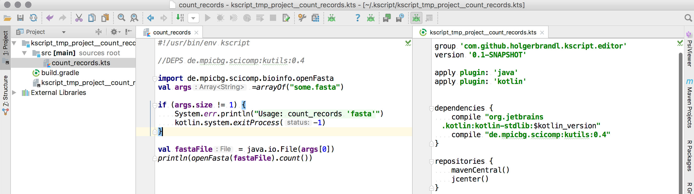
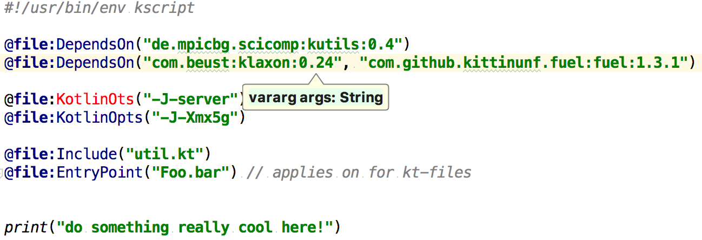
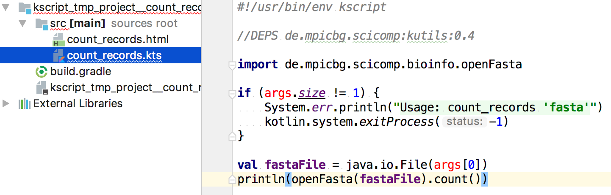
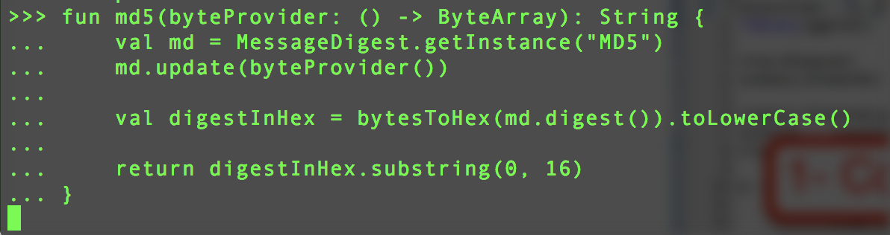

background-image: url(images/official_cover.jpg)
background-position: center
background-repeat: no-repeat
background-size: 100%


---

class: middle, inverse

```{r setup, include=FALSE}
options(htmltools.dir.version = FALSE)
require(methods)
```


<!-- ## Outline -->

## What are language requirements for data-driven science?

## Why Kotlin may be the right choice.

## How `kscript` provides enhanced scripting support for Kotlin.

???

part 1: my background, data scientiest/analyst working with various kinds of data. lessons I've learned.

* Software examples from academia
* Shortcomings of existing languages
* What works and what did not

part 2: argue that Kotlin might . short because assumed that audience knowns Kotlin. what's missing  yet


* botoom line: ombination of simplified language & very good dependency model/tooling

part 3: main part. obviously. how `kscript`, feature walkthroguh and examples.


* `kscript` Scripting enhancements Kotlin
* How Kotlin helps
* What's missing and what we can do about it


---
# Language requirements for data-driven science


### 1. Reproducible: Can we reproduce findings at a later date?

### 2. Rapid Prototyping: Can we quickly setup an analysis?

### 3. Scalable: Can we upscale scripts into systems and tools?

### 4. Community: Can we enable colleagues to analyze data?


???

tbd what science are we talking about here?

just technical, not what method etc as in https://www.kdnuggets.com/2016/08/core-data-science.html

walk through most common candidates when java, python, R, bit of bash

performance left out --> just a linear factor anyway. hard to to a non-biased comparision


community: analysts / scicntiest not engineers, sometimes even without a phds in computer science. curiopus about data. want to bring them onboard

---
# Stick to the basics for data-driven science?

> But it's faster and way shorter to do it bash! (unknown colleague)


Do _magical_ things in the terminal without dependencies

--

```bash
removeMultiMappers(){
perl -ne 'unless((!($_=~/^@.*/)&&!(m/AS:i:/))||(m/AS:i:(\S+).+XS:i:(\S+)/ && $1-$2<1)){print;}' 
}

bowtie2 $fastqFile | samtools view -SF 4 -  | removeMultiMappers | samtools sort - result.bam
```

--

> Marta Florio, Mareike Albert, Elena Taverna, Takashi Namba, **Holger Brandl**, Eric Lewitus, Christiane Haffner, Alex Sykes, Fong Kuan Wong, Jula Peters, E. Guhr, Sylvia Klemroth, Kay Prüfer, Janet Kelso, Ronald Naumann, Ina Nüsslein, Andreas Dahl, Robert Lachmann, Svante Pääbo, Wieland B. Huttner
  **Human-specific gene ARHGAP11B promotes basal progenitor amplification and neocortex expansion.**
  *Science* , 347(6229) 1465-1470 (2015)

Get published and forget.

### Fast to write. Impossible to maintain or to evolve. Does not scale. Unteachable black art.

???


`kscript` started of as a `bash` script until it hit a manageabilituy barrier at around ~500 polyglot (i.e. messy) lines.

**TODO** move kscript example to kscript section


hellfire A: fire & forget


Lesson learned: Don't stop when it *just* works. Don't use awkward methods to avoid an actual implementation.

just fast

Don't get me wrong: the linux shell is great. often see bloated apis, why? it's faster and way shorter to do it bash
Great frameworks like csv

but


---
background-image: url(images/0d638038_whiteend.jpg)
background-position: center
background-repeat: no-repeat
background-size: 100%

# Java for Data Science?

2001 - First contact:
> #### Evolving image processing for 2d gel electrophoresis analysis

<!-- .image-50[] -->

--

Likes
* Static typing provides guidance and context
* Type- and compile-time checking of code
* Ease of deployment
* Java dependency trees rock!

--

Dislikes
* Prototyping in the debugger
* Rerun apps again and again
* Lack of interactivity

--

### Java allows to write complex software but fails for explorative analysis and prototyping.


???

tag line: core of data-science, isn't it!!

* Did not know about REPL (python R, but experience felt flawed already

java first, guess most audience have java background.

Actually... first programming language after toying around with c while being in high-school

First API: JAI, quit a nut to crack
Very explorative --> prototyping

bottom line: great language, still love it.

<!-- .image-50[] -->
Dependencies:
Well formed tree with specific versions
Developer decides how to resolve versions conflicts

worked with java a lot since, dependncy manageent always amazed me

every dependency is specific about sub-depndency. No doubt how to assemble a system

tree conflicts, by pulling


---
# Java for Data Science?


### 1. Reproducible: Can we reproduce findings at a later date? 

### 2. Rapid Prototyping: Can we quickly setup an analysis? 












### 3. Scalable: Can we upscale scripts into systems and tools? 

### 4. Community: Can we enable colleagues to analyze data? 













???

Great because
1. Rock-solid dependency model
2. standardized deployment path
3. Scalabilty to build complex systems

They don't scale because of static typing.

Not so great
* Language complexity and readability
* Missing REPL & scriptability


repl started in j9. but overal languge evolution very slow.


---
# Most popular choices for data science?


R stronger for statistics and explorative data-analysis (dplyr, tidyr, rstudio).

Python more popular for machine learning (kaggle, keras, scikit)

Both are fun to teach and great for prototyping.

.left-column40[
.center[]
]

.right[

]

???

for sure other options but none of them really appealing

---
# Python Dependencies: The _best_ practice


```{r, engine='bash', eval=FALSE}
virtualenv my_scikit

source my_scikit/bin/activate

pip install -U scikit-learn

## actual logic goes in here!
/sw/bin/python -c '
from sklearn import datasets
... the cool stuff! 
'

deactivate
```

* Per project index only via `virtualenv`, which is tedious for small scale tasks
* No binaries, always (slowly) compiles from scratch

### No sound way to manage dependencies in python


???

`pip install --user somtehing` mostly works these days, but


I've tried.

Shed light on most crticial feature: Reproducitbilitgy.

But there's `virtualenv`/`pip`?!

Did not say impossible but lacks convenience and fault tolearnce

Often just scriplet are just about 10 lines, more overhead than usercode.

https://packaging.python.org/discussions/pip-vs-easy-install/


[Why I hate virtualenv and pip](https://pythonrants.wordpress.com/2013/12/06/why-i-hate-virtualenv-and-pip/)


"


---
# R dependencies

* No built-in way to indicate a specific dependency version for a project

* Also declaration of package-depdencies is sloppy by design

```
Imports: assertthat, bindrcpp (>= 0.2), glue (>= 1.1.1), magrittr,
        methods, pkgconfig, rlang (>= 0.1.2), R6, Rcpp (>= 0.12.7),
        tibble (>= 1.3.1), utils
```

* Existing approaches like [packrat](https://github.com/rstudio/packrat) no yet ready for primetime: build package index from scratch per project

--

.image-200[]


???


from http://127.0.0.1:30576/library/dplyr/DESCRIPTION

???


---
# Python and R fail to be _the_ solution for data science


### 1. Reproducible: Can we reproduce findings at a later date? 

### 2. Rapid Prototyping: Can we quickly do setup an analysis? 












### 3. Scalable: Can we upscale scripts into systems and tools? 

### 4. Learning curve: Can we enable colleagues to analyze data? 













???

How are `R` and `python` fail in the data science process?

Do not scale to more complex systems
and fail to provide a proper dependency tooling


1. No rock-solid dependency model
2. No standardized deployment path
3. Missing scalabilty to build complex systems

Don't get me wrong, they are
* Great for protoyping
* easy to get started with
* Amazing level of interactivity


Users reimplement prototype often in python but reimplement for speed and

That's why python does extremly well. Not because it's excellent in all recards. Su

Polls are biass, but kd-nuggest community poll: Surpassed R in popuarlatiy for data-science.

dynamic typing prevents scaling up systems


---
# How to deploy software for data-driven science?

Webservices don't scale with data. Bring tools to users. Example:

> Raphael Etournay, Marko Popović, Matthias Merkel, Amitabha Nandi, Corinna Blasse, Benoit Aigouy, Holger Brandl, Gene Myers, Guillaume Salbreux, Frank Jülicher, Suzanne Eaton  
  **Interplay of cell dynamics and epithelial tension during morphogenesis of the Drosophila pupal wing.**  
  *Elife* , 4 Art. No. e07090 (2015)

<section data-markdown>

<video controls>
<source src="9b__blue_square_tracking_rec.mp4" type="video/mp4">
Your browser does not support the video tag.
</video>

</section>


???

Understand how tissue shape changes emerge -> timelapse imaging --> trck cell, divivde, die, squeezed, --> build phycical model --> visualize & statistics


Great projct. one of my all-time favorites.

---
class: inverse, center, middle

background-image: url(images/wing_cropped.jpg)
background-position: center
background-repeat: no-repeat
background-size: 120%


# How to give it to the community?

--

# Dockerize it!

???

C++, python, java, R, --> hard to setup

---
background-image: url(images/wing_cropped_white.jpg)
background-position: center
background-size: 120%

## Tried it! 

--

## Sucessfully published! 

Raphael Etournay, Matthias Merkel, Marko Popović, **Holger Brandl**, Natalie Dye, Benoit Aigouy, Guillaume Salbreux, Suzanne Eaton, Frank Jülicher
  **TissueMiner: a multiscale analysis toolkit to quantify how cellular processes create tissue dynamics.**
  *Elife* , 5 Art. No. e14334 (2016)


https://github.com/mpicbg-scicomp/tissue_miner

--

```bash
alias tm='docker run --rm -ti -v $(dirname $PWD):/movies etournay/tissue_miner'
    
tm analyze_sheer <image_data>
tm track_cell_divisions <image_data>
```

--

## Doing _just_ docker-support since then. 

???

 Issues when shipping apps as executable containers

* Harder to communicate (especially to less experienced users)
* Harder to handle, i.e. ¡lack convenience of a true tool
* Quit some devops overhead just to keep it up and running


What do we learn:
> Bundling tools as containers not yet the way to go. More lightweight solution seem better.

Depends on environment. Academia environment, even if most colleuges hoave some phd, mostly not in computer science, but bio, chemistry. still interested. Also students, less techy staff--> harder & more support efforts

docker is great. use it almost daily.

Adds complexity layers that lacks ease of prototyping

can you send a script. can you send me 5gb container.

More an expert thing

Bottom Line: Scientist don't do web-serivces, the "just" write software. Difference between science & product devlopmen t.


---
# A better way to do with data science?

.left-column40[
* Reproducibility, Dependencies & Scalability: **Java**

* Prototyping & Community: **R & Python**

Fusion would be great:

####  Java with the ease of a scripting language

]

--

.right-column60[
_eierlegende Wollmilchsau_

.image[]

]


???

r&python mostly, java few,

would provide magic 4: Reproducible, Rapid Prototyping, Scalable, Community


Egg-laying wool-milk-sow?


Prototype today using something convenient such as python
* python
* R

Integrate workflows via the shell.

Reimplement later in a more production-ready language like
* java
* c++

Asking too much?


---
background-image: url(images/kotlin_logo.jpg)
background-position: center
background-repeat: no-repeat
background-size: 80%

# February 2016

.left-column40[

Kotlin v1.0 released

#### Type Inference
#### Extension Functions
#### Data Classes
#### DSLs in Mind
#### Default Parameters
#### Lives in JVM
#### Scripting Support

]

--

.right-column60[

.right[
Data Science Requirements
## Proper Dependency Model 
## Scales from idea to product 
## Teachable 
## Rapid Prototyping &nbsp;&nbsp;&nbsp;??
]
]

???

somewhen in early 2016 god seemed to have heard our prays, and gave us kotlin.

release day 15.2.

---

# Let's write a script!

```bash
kotlinc -script pipeline_prototype.kts
```

which is equivalent to
```kotlin
#!/usr/bin/env kotlinc -script

println("do stuff")

val data = readData() // not quite yet!
```

Issues with existing out-of-the-box `kotlinc` tooling
* How to pull in dependencies? `kotlinc -cp ...` seems too tedious. A separate gradle/maven file even more.
* `kotlinc` means recompile, so little scriptlets run slow
* How to keep track of required JVM/runtime options?
* More flexible way to provide scripts

???

shebang did not work out

---
class: inverse


Since March 2016

Enhanced scripting support for [Kotlin](https://kotlinlang.org/) on *nix-based systems.

> `kscript` provides an easy-to-use, very flexible, and almost zero-overhead solution to write self-contained mini-applications with Kotlin.

???

Kotlin has some built-in support for scripting already but it is not yet feature-rich enough to be a viable alternative in the shell.


---
# Core features of `kscript`

Wraps `kotlinc` and adds

### Compiled script caching (using md5 checksums)
### Dependency declarations using gradle-style resource locators
### More options to provide scripts
### Embedded runtime options
### Support library to ease the writing of Kotlin scriptlets

???

Taken all these features together, `kscript` provides an easy-to-use, very flexible, and almost zero-overhead solution to write self-contained mini-applications with Kotlin.

---

```{r, engine='bash', eval=FALSE}
# sdk install kscript  ## for details see http://sdkman.io/ 
kscript --help
```

```
kscript - Enhanced scripting support for Kotlin on *nix-based systems.

Usage:
 kscript [options] <script> [<script_args>]...
 kscript --clear-cache
 kscript --self-update

The <script> can be a  script file (*kts), a script URL, - for stdin, a *.kt source file 
with a main method, or some Kotlin code.

Use '--clear-cache' to wipe cached script jars and urls
Use '--self-update' to wipe cached script jars and urls

Options:
 -i --interactive        Create interactive shell with dependencies as declared in script
 -t --text               Enable stdin support API for more streamlined text processing
 --idea                  Open script in temporary Intellij session

Copyright : 2017 Holger Brandl
License   : MIT
Version   : v2.1.0
Website   : https://github.com/holgerbrandl/kscript
```

---
# Input Modes

There's a multitude of ways to serve a script to `kscript`

The `<script>` argument can be a
- script file (*kts),
- a script URL,
- `-` for stdin,
- some kotlin code
- a `*.kt` source file with a main method,


---
# Interpreter Usage

Use `kscript` as interpreter for a script `Example.kts` just point to it in the shebang line

```kotlin
#!/usr/bin/env kscript

println("hello world")
```

We can still run it directly with
```bash
kscript Example.kts
```
Or make executable and run directly
```bash
chmod +x Example.kts

./Example.kts
```


---
# Inlined Usage

Use `kscript` in a workflow without creating an additional script file.

* Directly provide a Kotlin scriptlet as argument

```bash
kscript 'println("hello world")'
```

* Pipe a Kotlin snippet into `kscript` and instruct it to read from `stdin` by using `-` as script argument

```bash
echo '
println("Hello Kotlin.")
' |  kscript -
```

* Use `heredoc` (preferred solution for inlining) which gives more flexibility. E.g. use single quotes in script

```bash
kscript - <<"EOF"
println("It's a beautiful day!")
EOF
```

???

also process substitution is also supported


---
# `kscript` can launch apps right from the internet


Example:
```bash
kscript 'https://git.io/v9R73' arg u ments
```

To streamline the usage, the first part could be even aliased:

```bash
alias hello_kscript="kscript https://git.io/v1cG6"
hello_kscript my argu ments
```

* Support remote tool repositories
* Allows for easy integration of remotely hosted (mini) programs into data pipelines
* Installation-free
* URLs are assumed to be static and will be cached via checksum.

---
# Write command line tools with _just_ the standard library

```kotlin
#!/usr/bin/env kscript

val stdin: Sequence<String> = generateSequence { readLine() }

stdin
    // retain only lines starting with digits 0 to 5
    .filter{ it.contains("^[0-5]{5}".toRegex()) }
    // add prefix
    .map { "id" + it }
    // print to stdout
    .forEach { println(it) }
```

Would work using `kotlinc -script` as interpreter as well, but would be painfully slow

---
# Be snappy by caching compiled scripts

`kscript` execution model
1. Calculate md5 of input script
2. Look up cached jar by md5; if not yet present create it
3. Use process substitution to replace `kscript` with `kotlin` process

All _kscripts_ are cached based on `md5` checksum, so running the same snippet again will be much faster

The cache directory is `~/.kscript` and can be cleared with `kscript --clear-cache`


---
# Directives

> Script sources are (often) not enough to _... write self-contained mini-applications with Kotlin._ (from kscript README)

Directives supported by `kscript`:

### `//DEPS` &nbsp; &nbsp; &nbsp; &nbsp; &nbsp; &nbsp; &nbsp; &nbsp; &nbsp; &nbsp; &nbsp; &nbsp;&nbsp; &nbsp; &nbsp; &nbsp;  Declare dependencies with gradle-style locators
### `//KOTLIN_OPTS` &nbsp; &nbsp;  Configure the kotlin/java runtime environment
### `//INCLUDE` &nbsp; &nbsp; &nbsp; &nbsp; &nbsp; &nbsp; &nbsp; &nbsp; &nbsp; &nbsp; Source kotlin files into the script
### `//ENTRY` &nbsp; &nbsp; &nbsp; &nbsp; &nbsp; &nbsp; &nbsp; &nbsp;  &nbsp; &nbsp; &nbsp;  &nbsp; &nbsp;&nbsp;  Declare application entrypoint for kotlin `*.kt` applications

???

think of them as annotation, first examples, comeback to that

---
# Declare dependencies with `//DEPS`


```kotlin
#!/usr/bin/env kscript

*//DEPS com.beust:klaxon:0.24, com.github.kittinunf.fuel:fuel:1.3.1
import com.beust.klaxon.*
import com.github.kittinunf.fuel.httpGet

require(args.isNotEmpty()) {
    println("Usage: id_converter <some_id>+")
    kotlin.system.exitProcess(-1)
}

val queryURL = "http://foo.com/bar?convert=${args.joinToString(",")}"
val json = String(queryURL.httpGet().response().second.data)
val jsonArray = Parser()
    .parse(json.byteInputStream())!! as JsonArray<*>

// use klaxon library to parse the json result 
val conversionTable = jsonArray.map { (it as JsonObject) }.map { 
    it.int("id") to it.string("converted") 
}.forEach { println(it) }
```
Run as tool with just `id_converter.kts 232 42323 23`


---
# Configure the runtime  with `//KOTLIN_OPTS`

Just passed on to `kotlin`.

Example: Filter dna-sequences by length

```kotlin
#!/usr/bin/env kscript

//DEPS de.mpicbg.scicomp:kutils:0.4
*//KOTLIN_OPTS -J-Xmx5g -J-server
 
import de.mpicbg.scicomp.bioinfo.openFasta

if (args.size != 2) {
    System.err.println("Usage: fasta_filter <fasta> <max_length>")
    kotlin.system.exitProcess(-1)
}

val fastaFile = java.io.File(args[0])
val lengthCutoff = args[1].toInt()

openFasta(fastaFile).
        filter { it.sequence.length >= lengthCutoff }.
        forEach { print(it.toEntryString()) }
```

???

this is what's needed most of the time

---
# Ease prototyping with `//INCLUDE`

Artifacts are the proper way!

But many other languages allow to directly include source files.


```kotlin
//utils.kt
fun Array<Double>.median(): Double {
    val (lower, upper) = sorted().let { take(size / 2) to takeLast(size / 2) }
    return if (size % 2 == 0) (lower.last() + upper.first()) / 2.0 else upper.first()
}
```
`kscript` allows to skip artifact deployment by using `//INCLUDE`


```kotlin
#!/usr/bin/env kscript


*//INCLUDE utils.kt
*//INCLUDE https://github.com/krangl/blob/src/MathHelpers.kt

val robustMean = listOf(1.3, 42.3, 7.).median()
println(robustMean)
```
???

The **median** is the value separating the higher half of a data [sample](https://en.wikipedia.org/wiki/Sample_(statistics) "Sample (statistics)"),


Again prototyping vs development

https://stackoverflow.com/questions/36959031/how-to-source-file-into-python-script

https://kotlinlang.org/api/latest/jvm/stdlib/kotlin.collections/average.html


---
#  Use `//ENTRY` to run applications with `main` method

`kscript` also supports running regular Kotlin `kt` files.

Example: `./examples/Foo.kt`:

```kotlin
package examples

//ENTRY examples.Foo

class Foo{
    companion object {
        @JvmStatic fun main(args: Array<String>) {
            println("Foo was called")
        }
    }
}

fun main(args: Array<String>) =  println("main was called")
```

To run top-level main instead we would use `//ENTRY examples.FooKt`

The latter is the default for `kt` files and could be omitted


---
# Replace `awk`ward terminal programming with Kotlin

`kscript` can be used as a speedier and more flexible substitute for built-in terminal tools such as `awk` or `sed`

Use `-t`/`--text` to enable a support-api for line-based text-processing


* Delete a column

```{r, engine='bash', eval=FALSE}
awk '!($3="")'  some_flights.tsv
kscript -t 'lines.split().select(-3).print()' some_flights.tsv 
```


* Delete trailing white space (spaces, tabs)
```{r, engine='bash', eval=FALSE}
awk '{sub(/[ \t]*$/, "");print}' file.txt
kscript -t 'lines.map { it.trim() }.print()' file.txt
```

See https://github.com/holgerbrandl/kscript-support-api and [kscript as substitute for awk](https://holgerbrandl.github.io/kotlin/2017/05/08/kscript_as_awk_substitute.html)

---
# Pimp your REPL with `--interactive`

```kotlin
#!/usr/bin/env kscript
*//DEPS de.mpicbg.scicomp:kutils:0.4
import de.mpicbg.scicomp.bioinfo.openFasta

if (args.size != 1) {
    System.err.println("Usage: CountRecords <fasta>")
    kotlin.system.exitProcess(-1)
}

val records = openFasta(java.io.File(args[0]))
println(records.count())
```
Bootstrap interactive shell from your script. Example: `CountRecords.kts`

```bash
kscript --interactive CountRecords.kts
```

```
Creating REPL from /Users/brandl/Dropbox/kscript_kotlinconf_2017/code_examples/count_records.kts
Welcome to Kotlin version 1.1.51 (JRE 1.8.0_151-b12)
>>> import de.mpicbg.scicomp.bioinfo.openFasta
>>> 
```

---
# Bootstrap project from scripts with `--idea`


* Artifacts and versions will differ between scripts.
* `kscript` allows to create temporary project from script using Gradle

```bash
kscript --idea CountRecords.kts
```


Requires command-line launcher `idea` to be setup via `Tools->Command Line Launcher`

???


* Vote for: [KT-13347](https://youtrack.jetbrains.com/issue/KT-13347) Good code is red in injected kotlin language snippets


---

class: inverse, center, middle

# What's next?

---

## Replace comment `//` directives with annotations

Using proper file annotations would be better design and also allow for better tooling

```kotlin
// DEPS log4j:log4j:1.2.14

@file:DependsOn("log4j:log4j:1.2.14")
@file:KotlinOpts("-J-Xmx5g")
```


No such thing as `DependsOn` in kotlin stdlib. To enable correct code parsing add ` com.github.holgerbrandl:kscript-annotations:1.0` as dependency to the Intellij project


.center[.image-75[]]


???

keplin: Secure Kotlin scripting and binary lambda-scripts


We would prefer annotations over custom syntax!

don't reinvent the wheel, follow the communiy ... support the moment it goes live.

Why not default?

---
# Getting serious about scripting with KEEP [#75 ](https://github.com/Kotlin/KEEP/issues/75)

Great proposal that aims to unify various aspects of scripting in a common API

* Define Kotlin scripting and it's applications
* Describe intended use cases for the Kotlin scripting
* Provide sufficient control of interpretation and execution of scripts
* Provide usable default components and configurations for the typical use cases

--

Some core aspects are implemented  by `kscript`!

* IDE/tooling support via `--idea`
* Project-level REPL `--interactive`
* Directives/annotations modulate includes, and dependency and runtime environment

--

.left-column50[

#### Will kill it `kscript`? Maybe.
#### Looking forward to tool convergence!
]

.left-column50[


]

???

Kotlin Evolution and Enhancement Process

Ilya Chernikov

Will make `kscript` superfluous? Not any time soon given previous speed

Kscript mostly overlaps with https://github.com/Kotlin/KEEP/blob/scripting/proposals/scripting-support.md#standalone-scripting

---
# Next steps?


* Go `kotlin-native*` to remove JVM launch overhead
```bash
exec $(kotlin -classpath ${jarPath} kscript.app.KscriptKt "$@")
```
* Support for custom artifact repositories

* Pray for [KT-16802](https://youtrack.jetbrains.com/issue/KT-16802) _Good code is always red when editing kts-script files under Kotlin v1.1_ to become fixed

.center[.image-50[.images[]]]

#### Not much left to do. :-) Don't get infected by _featureritis_!

#### `kscript` is unit- and battle-tested, and ready production!


---
# Dream, dream, dream...

* Revise annotation-driven script configuration once [KEEP75](https://github.com/Kotlin/KEEP/issues/75) Scripting API  supports it

* Use [kohesive/keplin-maven-resolver](https://github.com/kohesive/keplin) for dependency resolution instead of `mvn`

* DSL-support: Derive new interpreters from `kscript`

```kotlin
#!/usr/bin/env tornando-fx-script

class HelloWorld : View() {
    override val root = hbox {
        label("Hello world")
    }
}
```

* _&lt;your ideas here!&gt;_ just go to https://github.com/holgerbrandl/kscript

???

Recently implemented in [kohesive/keplin](https://github.com/kohesive/keplin)**
and used for `[kotlin-jupyter](https://github.com/ligee/kotlin-jupyter)` kernel, so maybe integrate it from there.


native requires at least some 'java.io.File'-like native API


DSL talk: Frederico Tomasetti
https://github.com/Kotlin/KEEP/issues/75

https://github.com/Kotlin/KEEP/blob/scripting/proposals/scripting-support.md

---
## What's still missing in Kotlin to rule data-science?

1. **Interactivity**: Improve jupyter-kernel support (interactive usage, idea notebook editor support)
2. **More Kotlin DataScience APIs** for modeling ([pandas](http://pandas.pydata.org/), [dplyr](http://dplyr.tidyverse.org/)) and visualization ([ggplot2](http://ggplot2.org/), [seaborn](https://community.modeanalytics.com/python/libraries/seaborn/), [d3](https://d3js.org/))

3. **Fix the REPL** a be not just a `re` wihout `pl`

4. **Data-Science IDE** Provide a _cut down_ version IJ for Kotlin.

???


--

.left-column40[

.image-200[]
]


--

.right-column50[
.image-85[]
]

???

Read–eval–print_loop

long way python and r are miles ahead with the data-sciencelibrariess.


---
class: inverse

# Summary


### Kotlin may be the right choice for data science.

### `kscript` provides enhanced scripting support for Kotlin.

### `kscript` allows to replace scripts written in `ruby`, `python`, `bash`, `r` etc. with Kotlin

--


Questions and pull requests are welcome.

For these slides, more docs, examples see https://github.com/holgerbrandl/kscript

Thanks for your attention.


???
Reproducilbe, protoyping, scalable, flat learning curve to build community